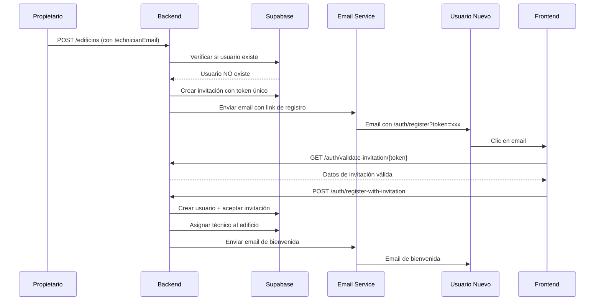
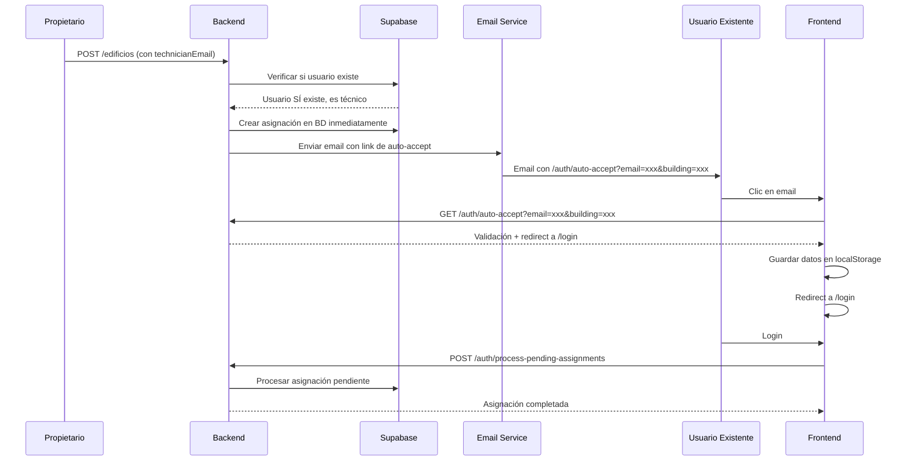

# Sistema de Invitaciones - Guía Técnica

Esta guía explica en detalle cómo funciona el sistema de invitaciones implementado en Activo Digital Backend.

## 🎯 Resumen del Sistema

El sistema de invitaciones permite a los propietarios invitar técnicos y CFOs a sus edificios mediante emails. El sistema maneja dos escenarios principales:

1. **Usuario Nuevo**: Registro con invitación
2. **Usuario Existente**: Asignación directa con notificación

## 🔄 Flujos Detallados

### Flujo 1: Usuario Nuevo (Registro con Invitación)



### Flujo 2: Usuario Existente (Asignación Directa)



## 🏗️ Arquitectura Técnica

### Componentes Principales

#### 1. **EdificioService** (`src/domain/services/edificioService.ts`)
```typescript
// Método principal que maneja la lógica de invitaciones
async handleTechnicianAssignment(
  technicianEmail: string, 
  buildingId: string, 
  userAuthId: string
): Promise<void>

// Para usuarios existentes
async assignTechnicianToBuilding(
  buildingId: string, 
  technicianAuthId: string, 
  assignedByUserId: string
): Promise<void>
```

#### 2. **EmailService** (`src/domain/services/emailService.ts`)
```typescript
// Genera templates de email dinámicos
private generateInvitationEmail(
  invitation: Invitation, 
  building: Building, 
  invitedByUser: any
): EmailTemplate

// Envía emails usando Supabase Edge Functions
async sendInvitationEmail(
  invitation: Invitation, 
  building: Building, 
  invitedByUser: any
): Promise<void>
```

#### 3. **AuthController** (`src/web/controllers/authController.ts`)
```typescript
// Valida invitaciones
export const validateInvitationController = async (req: Request, res: Response)

// Registro con invitación
export const registerWithInvitationController = async (req: Request, res: Response)

// Auto-accept para usuarios existentes
export const autoAcceptController = async (req: Request, res: Response)

// Procesa asignaciones pendientes después del login
export const processPendingAssignmentsController = async (req: Request, res: Response)
```

### Base de Datos

#### Tabla `invitations`
```sql
CREATE TABLE invitations (
    id UUID PRIMARY KEY DEFAULT uuid_generate_v4(),
    email VARCHAR(255) NOT NULL,
    role_id UUID NOT NULL REFERENCES roles(id),
    building_id UUID NOT NULL REFERENCES buildings(id),
    token VARCHAR(255) NOT NULL UNIQUE,
    status VARCHAR(20) NOT NULL DEFAULT 'pending',
    expires_at TIMESTAMP WITH TIME ZONE NOT NULL,
    created_by UUID NOT NULL REFERENCES users(id),
    created_at TIMESTAMP WITH TIME ZONE DEFAULT NOW(),
    accepted_at TIMESTAMP WITH TIME ZONE,
    accepted_by UUID REFERENCES users(id)
);
```

#### Tabla `building_technician_assignments`
```sql
CREATE TABLE building_technician_assignments (
    id UUID PRIMARY KEY DEFAULT uuid_generate_v4(),
    building_id UUID NOT NULL REFERENCES buildings(id),
    technician_id UUID NOT NULL REFERENCES users(id),
    assigned_by UUID NOT NULL REFERENCES users(id),
    assigned_at TIMESTAMP WITH TIME ZONE DEFAULT NOW(),
    status VARCHAR(20) NOT NULL DEFAULT 'active',
    UNIQUE(building_id, technician_id)
);
```

## 📧 Sistema de Emails

### Supabase Edge Functions

#### `send-invitation-email`
```typescript
// Ubicación: supabase/functions/send-invitation-email/index.ts
// Función que envía emails usando Resend API
// Recibe: to, subject, html, text, invitation, building, invitedBy
// Retorna: success, message, emailId
```

#### `send-welcome-email`
```typescript
// Ubicación: supabase/functions/send-welcome-email/index.ts
// Función que envía emails de bienvenida
// Recibe: to, subject, html, user
// Retorna: success, message, emailId
```

### Templates de Email

#### Template de Invitación (Usuario Nuevo)
```html
<!-- Generado dinámicamente en EmailService -->
<h1>¡Has sido invitado a unirte como Técnico!</h1>
<p>Un propietario te ha invitado a formar parte del equipo de Edificio Ejemplo como Técnico.</p>
<a href="https://edificio-digital.fly.dev/auth/register?token=xxx">Aceptar Invitación</a>
```

#### Template de Asignación (Usuario Existente)
```html
<!-- Generado dinámicamente en EmailService -->
<h1>¡Nueva asignación como Técnico!</h1>
<p>Un propietario te ha asignado como Técnico en un nuevo edificio.</p>
<a href="https://edificio-digital.fly.dev/auth/auto-accept?email=xxx&building=xxx">Aceptar Asignación</a>
```

## 🔧 Configuración

### Variables de Entorno Requeridas

#### Backend (Fly.io)
```bash
SUPABASE_URL=https://eqyevtkljwvhfsohawrk.supabase.co
SUPABASE_ANON_KEY=eyJhbGciOiJIUzI1NiIsInR5cCI6IkpXVCJ9...
SUPABASE_SERVICE_ROLE_KEY=eyJhbGciOiJIUzI1NiIsInR5cCI6IkpXVCJ9...
```

#### Supabase Edge Functions
```bash
RESEND_API_KEY=re_xxxxxxxxxxxxxxxxx
FRONTEND_URL=https://edificio-digital.fly.dev
```

### URLs de Producción
```typescript
// URLs correctas en producción:
const REGISTER_URL = `https://edificio-digital.fly.dev/auth/register?token=${token}`;
const AUTO_ACCEPT_URL = `https://edificio-digital.fly.dev/auth/auto-accept?email=${email}&building=${buildingId}`;
const ACCEPT_ASSIGNMENT_URL = `https://edificio-digital.fly.dev/auth/accept-assignment?email=${email}&building=${buildingId}`;
```

## 🐛 Troubleshooting

### Problema: Emails no se envían
**Síntomas**: No llegan emails de invitación
**Causas posibles**:
1. `RESEND_API_KEY` no configurada en Supabase
2. `FRONTEND_URL` incorrecta
3. Edge Functions no desplegadas

**Solución**:
```bash
# Verificar variables en Supabase Dashboard
npx supabase secrets list --project-ref tu_project_id

# Configurar si faltan
npx supabase secrets set RESEND_API_KEY=tu_api_key --project-ref tu_project_id
npx supabase secrets set FRONTEND_URL=https://edificio-digital.fly.dev --project-ref tu_project_id

# Redesplegar Edge Functions
npx supabase functions deploy send-invitation-email --project-ref tu_project_id
npx supabase functions deploy send-welcome-email --project-ref tu_project_id
```

### Problema: Usuario existente no se asigna
**Síntomas**: Usuario existente recibe email pero no aparece en lista de activos
**Causas posibles**:
1. Error en `assignTechnicianToBuilding`
2. Error en procesamiento de asignaciones pendientes
3. Error en frontend localStorage

**Solución**:
```bash
# Verificar logs del backend
fly logs

# Buscar estos logs específicos:
# 🏢 CREANDO ASIGNACIÓN en BD para técnico existente
# ✅ ASIGNACIÓN CREADA en BD exitosamente
# 📧 Enviando EMAIL DE ASIGNACIÓN para técnico existente
# ✅ EMAIL DE ASIGNACIÓN enviado exitosamente
```

### Problema: URLs incorrectas en emails
**Síntomas**: Links en emails llevan a páginas incorrectas
**Causas posibles**:
1. `FRONTEND_URL` mal configurada
2. URLs hardcodeadas en código

**Solución**:
```bash
# Verificar variable en Supabase
npx supabase secrets list --project-ref tu_project_id

# Debe ser:
FRONTEND_URL=https://edificio-digital.fly.dev
```

### Problema: Frontend no procesa asignaciones pendientes
**Síntomas**: Usuario hace login pero no ve edificio asignado
**Causas posibles**:
1. Error en `AuthContext.tsx`
2. Error en `processPendingAssignments`
3. Error en localStorage

**Solución**:
```typescript
// Verificar en frontend AuthContext.tsx
const login = async (token: string): Promise<void> => {
  localStorage.setItem('access_token', token);
  await loadUser();
  
  // Verificar que este código esté presente:
  const pendingAssignmentData = localStorage.getItem('pendingAssignment');
  if (pendingAssignmentData) {
    const pendingAssignment = JSON.parse(pendingAssignmentData);
    const result = await processPendingAssignments(
      pendingAssignment.email,
      pendingAssignment.buildingId
    );
    if (result.success) {
      localStorage.removeItem('pendingAssignment');
    }
  }
};
```

## 📊 Monitoreo y Logs

### Logs Importantes del Backend
```bash
# Logs de procesamiento de técnicos
🎯 PROCESANDO TÉCNICO: email@ejemplo.com
🔍 ASIGNACIÓN TÉCNICO - Email: email@ejemplo.com | Building: uuid-edificio
✅ Usuario existe - Rol: tecnico | ID: uuid-usuario
🏢 CREANDO ASIGNACIÓN en BD para técnico existente
✅ ASIGNACIÓN CREADA en BD exitosamente
📧 Enviando EMAIL DE ASIGNACIÓN para técnico existente
✅ EMAIL DE ASIGNACIÓN enviado exitosamente
✅ TÉCNICO PROCESADO EXITOSAMENTE
```

### Logs de Edge Functions
```bash
# Logs de envío de emails
📧 Sending email via Resend API...
📧 Email data: { to: "email@ejemplo.com", subject: "..." }
📧 Resend response status: 200
Email sent successfully: { id: "email-id", ... }
```

### Métricas a Monitorear
- **Emails enviados**: Verificar logs de Edge Functions
- **Asignaciones creadas**: Verificar logs del backend
- **Errores de validación**: Monitorear logs de auth
- **Performance**: Dashboard de Fly.io

## 🔒 Seguridad

### Tokens de Invitación
- **Generación**: Tokens únicos con `uuid_generate_v4()`
- **Expiración**: 7 días automáticos
- **Validación**: Verificación de existencia y expiración
- **Uso único**: Tokens se marcan como `accepted` al usarse

### Validaciones de Seguridad
- **Ownership**: Solo propietarios pueden invitar a sus edificios
- **Roles**: Validación de roles en cada operación
- **RLS**: Row Level Security en todas las tablas
- **Sanitización**: Validación de entrada en todos los endpoints

### Políticas de Acceso
```sql
-- Solo propietarios pueden crear invitaciones para sus edificios
CREATE POLICY invitations_owner_policy ON invitations
    FOR ALL USING (
        EXISTS (
            SELECT 1 FROM buildings 
            WHERE buildings.id = invitations.building_id 
            AND buildings.owner_id = auth.uid()
        )
    );

-- Solo técnicos pueden ver sus propias asignaciones
CREATE POLICY technician_assignments_policy ON building_technician_assignments
    FOR SELECT USING (technician_id = auth.uid());
```

## 🚀 Optimizaciones Futuras

### Mejoras Planificadas
1. **Rate Limiting**: Limitar invitaciones por usuario/día
2. **Bulk Invitations**: Invitar múltiples usuarios a la vez
3. **Email Templates**: Templates más personalizables
4. **Analytics**: Métricas de conversión de invitaciones
5. **Notifications**: Notificaciones push para asignaciones

### Escalabilidad
- **Caching**: Cache de usuarios existentes
- **Queue System**: Cola para procesamiento de emails
- **Batch Processing**: Procesamiento en lotes
- **CDN**: CDN para templates de email

---

**Última actualización:** Enero 2025  
**Versión:** 4.3.0  
**Estado:** Producción Ready
